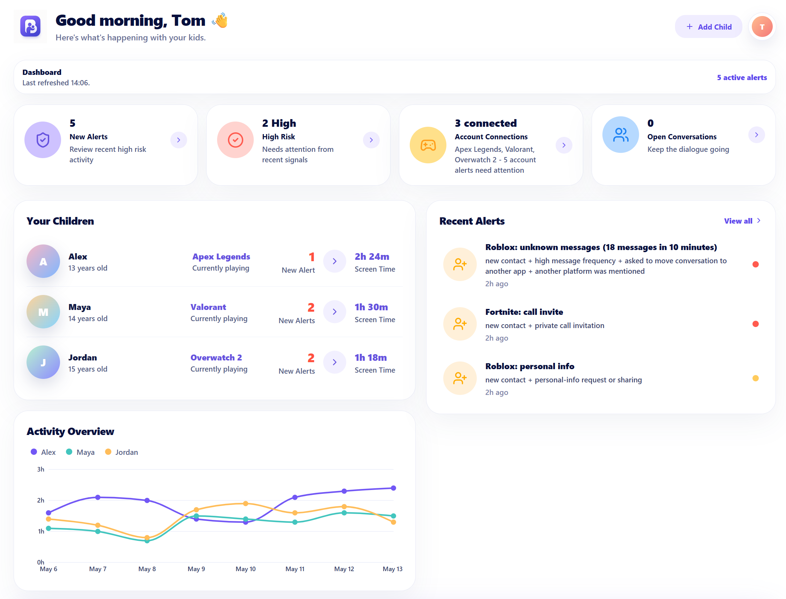

# Bumper Frontend

Lovable/TanStack Start prototype for the Bumper parent dashboard.



## Run

```bash
bun install
cp .env.example .env.local
bun run dev
```

The browser uses same-origin `/api/*` calls. The server proxy forwards those calls to `BACKEND_API_BASE_URL`.

For local backend development:

```dotenv
BACKEND_API_BASE_URL=http://127.0.0.1:8787
DEMO_TRIGGER_KEY=local-demo-trigger-key
DEMO_API_KEY=local-demo-key
VITE_DEMO_CONTROL_PANEL_URL=http://127.0.0.1:8787/demo
```

## Useful Commands

```bash
bun run lint
npx --yes vitest run
bun run build
```

## Notes

This is a hackathon prototype, not production monitoring software. Browser code should never contain demo API secrets.

MIT licensed from the repo root.
